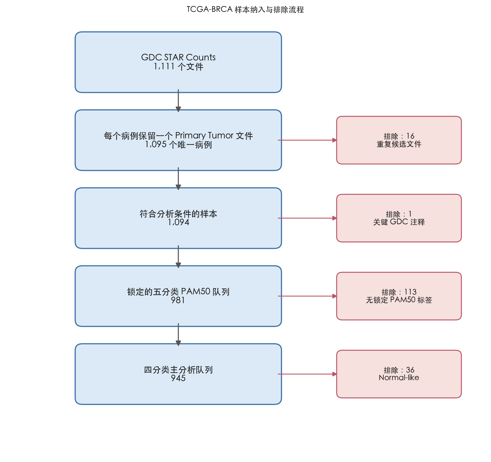
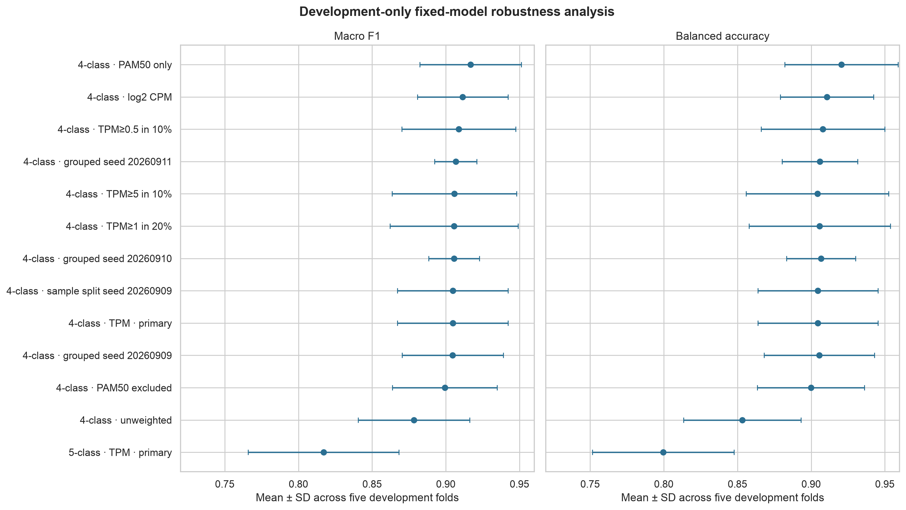

# OncoStratify-BRCA

**Interpretable machine learning for breast cancer molecular subtype classification from TCGA-BRCA transcriptomes**

This repository is a complete, leakage-controlled analysis of whether bulk RNA-seq profiles can recover four major PAM50 breast cancer subtypes. It combines locked patient-level evaluation, nested cross-validation, a one-time held-out test, three levels of model explanation, biological validation, and an isolated full-reproduction mode.

> **Research use only.** This project predicts retrospective PAM50 labels in TCGA-BRCA. It is not a diagnostic device, does not predict treatment benefit or patient outcome, and has not been validated for clinical use.

**Project status:** complete and verified · canonical snapshot `2026-09-13`

## At a glance

| | |
|---|---|
| Scientific question | Can patient-level tumour transcriptomes reproduce established PAM50 subtype labels under a strictly leakage-controlled evaluation? |
| Data | NCI GDC TCGA-BRCA STAR Counts, Data Release 46.0; GENCODE v36 |
| Primary task | Four-class classification: Luminal A, Luminal B, Basal-like, HER2-enriched |
| Primary cohort | 945 cases: 756 development + 189 locked test |
| Evaluation | Patient-grouped 5×5 nested stratified CV, followed by one frozen test evaluation |
| Selected model | Balanced random forest with training-fold-only filtering and feature selection |
| Locked-test result | Balanced accuracy **0.907** (95% CI 0.855–0.945); macro F1 **0.885** (0.836–0.929) |
| Interpretation | Elastic-net coefficients, held-out permutation importance, cross-fold stability, and TreeSHAP |
| Reproducibility | Nine Make targets, checksummed artifacts, immutable canonical locks, isolated replay mode |

## Scientific question and hypothesis

Breast cancer contains reproducible molecular subtypes with distinct transcriptional programs. The primary hypothesis was that a regularized or ensemble classifier trained on bulk tumour RNA-seq could recover the four major PAM50 labels with high macro F1 and balanced accuracy, while retaining performance after direct PAM50 signature genes were removed.

The task is intentionally narrow: it measures agreement with an established expression-derived label system. It does **not** establish new disease classes or demonstrate clinical utility.

## Cohort and study design

The locked GDC manifest contains 1,111 STAR Counts files. After selecting one Primary Tumor sample per case, the matrix contains 1,095 cases × 60,660 genes, including 19,962 protein-coding genes. Locked PanCancer Atlas annotations provide 981 five-class cases; excluding the 36 Normal-like cases yields the 945-case primary four-class cohort.



The split was fixed before model comparison using seed `20260909`:

```text
945 four-class cases
├── 756 development cases
│   └── 5 outer folds × 5 inner folds, stratified and patient-grouped
└── 189 locked-test cases
    └── opened once after model and procedure freeze
```

The five-class sensitivity cohort contains 981 cases: 785 development and 196 locked test. Full class counts and exploratory diagnostics are available in the [EDA report](outputs/eda/eda_report.md).

## Methods

All data-dependent preprocessing is fitted inside the applicable training fold:

```text
protein-coding log2(TPM + 1)
  → low-expression filter
  → median imputation
  → top-variance feature selection
  → standard scaling
  → classifier
```

The low-expression rule retains genes with TPM ≥ 1 in at least 10% of the current training partition. Inner CV selects among 100, 500, 1,000, or 2,000 high-variance features where applicable. Candidate models were:

- DummyClassifier with empirical class priors;
- multinomial logistic regression with L2 regularization;
- multinomial elastic-net logistic regression with balanced class weights;
- balanced LinearSVC with training-only sigmoid calibration for ROC/PR analysis;
- balanced random forest with prespecified grids for feature count, tree count, depth, leaf size, and `max_features`.

The preregistered selection metric was mean outer-fold macro F1; balanced accuracy was a co-primary reported metric. A `0.01` macro-F1 tie threshold triggered a parsimony rule only if required. Evaluation also reports accuracy, per-class precision/recall/F1, one-vs-rest ROC-AUC, average precision (PR-AUC), confusion matrices, and case-level stratified bootstrap confidence intervals.

The complete frozen design is in [the protocol](docs/protocol.md), [evaluation configuration](config/evaluation.json), and [final model lock](config/final_model_lock_v1.json).

## Results

### Development-only model comparison

Values are the mean ± sample standard deviation across five outer folds. No locked-test results were used for model selection.

| Model | Macro F1 | Balanced accuracy | Macro OvR ROC-AUC | Macro PR-AUC |
|---|---:|---:|---:|---:|
| Dummy prior | 0.173 ± 0.001 | 0.250 ± 0.000 | 0.500 | 0.250 |
| Logistic regression, L2 | 0.866 ± 0.043 | 0.881 ± 0.042 | 0.981 | 0.944 |
| Logistic regression, elastic-net | 0.890 ± 0.053 | 0.901 ± 0.050 | 0.985 | **0.955** |
| LinearSVC | 0.872 ± 0.034 | 0.890 ± 0.042 | 0.977 | 0.934 |
| **Random forest** | **0.905 ± 0.038** | **0.905 ± 0.041** | **0.986** | 0.954 |

The random forest exceeded the elastic-net by `0.015` mean macro F1, so the tie rule was not invoked. All five outer folds selected 2,000 genes, 750 trees, depth 16, leaf size 1, and `max_features="sqrt"`.


### Locked-test performance

After model and procedure freeze, the selected random forest was evaluated once on 189 held-out cases.

| Metric | Estimate | 95% stratified-bootstrap CI |
|---|---:|---:|
| Balanced accuracy | **0.907** | 0.855–0.945 |
| Macro F1 | **0.885** | 0.836–0.929 |
| Accuracy | 0.884 | — |
| Macro OvR ROC-AUC | 0.981 | — |
| Macro average precision | 0.927 | — |

| Subtype | n | Precision | Recall | F1 | OvR ROC-AUC | PR-AUC |
|---|---:|---:|---:|---:|---:|---:|
| Luminal A | 100 | 0.955 | 0.850 | 0.899 | 0.985 | 0.987 |
| Luminal B | 39 | 0.694 | 0.872 | 0.773 | 0.949 | 0.840 |
| Basal-like | 34 | 1.000 | 0.971 | 0.985 | 0.998 | 0.994 |
| HER2-enriched | 16 | 0.833 | 0.938 | 0.882 | 0.990 | 0.887 |


### Confusion matrices and discrimination curves

The following development out-of-fold plots aggregate predictions from the outer validation folds. They are independent of inner-fold tuning and precede the one-time locked-test evaluation.


The [unified performance report](outputs/performance_report/unified_performance_report.md) contains every per-class result, curve, confidence interval, and PAM50-included/excluded comparison.

## Interpretation and biological validation

Interpretation was separated into three levels:

1. **Global:** cross-fold elastic-net coefficients and random-forest permutation importance calculated only on held-out outer folds.
2. **Subtype-level:** top positive and negative elastic-net genes for each class, with top-20 frequency across outer folds as the stability measure.
3. **Individual:** TreeSHAP for six prediction-defined locked-test cases using a background of 100 development-only cases.

The locked stability rule identified 58 genes: 14 overlap the PAM50 signature, 34 are non-PAM50 genes with strong internal ER/PR/HER2 associations, and 10 remain model-associated candidates requiring external validation. Recovered signals included `ESR1`, `ERBB2`, `FOXA1`, `FOXC1`, `GRB7`, `KRT17`, `CENPF`, `MAPT`, and `XBP1`; expected markers were audited but never forced into the results.


Using all expression-filtered protein-coding genes as the enrichment background, significant results included estrogen response, ERBB/EGFR signalling, gland development, growth regulation, and extracellular-matrix organization. These are association-level findings, not evidence of causality.


See the [interpretability and biological validation report](outputs/interpretability/interpretability_report.md) for class-specific genes, receptor associations, enrichment tables, and individual SHAP explanations.

## Robustness checks

All robustness analyses were development-only fixed-model experiments; none reopened the canonical locked test.

| Scenario | Mean macro F1 | Difference from primary |
|---|---:|---:|
| Four-class primary, log2 TPM | 0.905 | reference |
| Five-class, including Normal-like | 0.817 | −0.088 |
| PAM50 genes excluded | 0.899 | −0.005 |
| Alternative log2 CPM preprocessing | 0.911 | +0.007 |
| Alternative low-expression rules | 0.906–0.909 | +0.001 to +0.004 |
| No class weighting | 0.878 | −0.026 |
| PAM50 genes only | 0.917 | +0.012 |
| Three patient-grouped seeds | 0.905–0.907 | −0.000 to +0.002 |



Raw PanCancer Atlas labels, locked labels, matrix labels, and split labels were 100% concordant. An independent TCGA 2012 PAM50 freeze agreed on 398/447 overlapping cases (`89.0%`, Cohen's κ `0.838`), showing that label versions are highly—but not perfectly—stable. See the [robustness and limitations report](outputs/robustness/robustness_and_limitations_report.md).

## PAM50 circularity and limitations

- **Expression-derived target:** PAM50 labels are defined from expression patterns, so this project demonstrates reproducibility of an existing taxonomy rather than independent biological discovery.
- **Residual proxy signal:** excluding the 50 signature genes removes direct inputs but not correlated pathways or co-expression proxies. The small performance change does not prove independence from PAM50 biology.
- **Single retrospective cohort:** all training, evaluation, biological checks, and robustness analyses use TCGA-BRCA. External cohorts, platforms, and prospective settings remain untested.
- **Batch structure:** RNA plate had the largest adjusted subtype association (`V=0.117`) and a batch-only CV balanced accuracy of `0.288` versus five-class chance level `0.20`. This indicates detectable but weak overlap, not proof that technical variation is absent.
- **Class imbalance:** HER2-enriched is small and Normal-like contains only 36 cases; the five-class performance drop is therefore interpreted cautiously.
- **Correlated features:** elastic-net coefficients, permutation importance, and SHAP divide credit among correlated genes. A top-ranked gene is neither a unique mechanism nor a causal claim.
- **No clinical claim:** the endpoint is PAM50 label agreement, not diagnosis, prognosis, survival, drug response, or treatment selection.

The next scientific step is external validation with the preprocessing, feature rules, parameters, and label mapping frozen in advance.

## Reproduce or audit the project

### Requirements

- macOS or Linux with `bash`, GNU Make, Python 3.12, and network access for a fresh GDC download;
- approximately 4.4 GiB for locked raw STAR Counts plus about 765 MiB for derived matrices;
- substantially more runtime for the full nested-CV, SHAP, and 65-fit robustness replay than for integrity verification.

Python dependencies are exactly pinned across the four `requirements-*.txt` files.

### Canonical verification

From a fresh clone:

```bash
git clone https://github.com/boyue-boboyue/precision-brca-transcriptomics.git
cd precision-brca-transcriptomics
make environment
make test
```

`make test` follows the complete dependency chain. Missing Git-excluded arrays trigger download of the 1,111 files in the locked GDC manifest, MD5/size verification, matrix reconstruction, and SHA-256 comparison with the committed manifest. Existing canonical model, final-test, and interpretation artifacts are verified without reopening protected data-dependent decisions.

The nine public entry points are:

```bash
make environment
make metadata
make cohort
make matrix
make eda
make train
make evaluate
make explain
make test
```

```text
environment → metadata → cohort → matrix → eda → train → evaluate → explain → test
```

Use `GDC_DOWNLOAD_WORKERS=4` to change download parallelism. Rebuild presentation figures and reports from frozen result tables with:

```bash
make test REBUILD_REPORTS=1
```

### Isolated computational replay

To recompute the analysis without overwriting canonical locks or published artifacts:

```bash
make test \
  REPRODUCTION=1 \
  REPRO_DIR=work/reproduction/run-001 \
  N_JOBS=1 \
  FOREST_N_JOBS=4
```

The replay creates independent model/test/interpretability locks, access records, outputs, and an append-only audit trail inside `REPRO_DIR`. Completed stages can be resumed; partial stage outputs are never overwritten. Preview every command without writing a workspace:

```bash
make test REPRODUCTION=1 REPRO_DRY_RUN=1
```

The isolation guarantees and equivalence rules are documented in [reproduction mode](docs/reproduction.md).

## Repository map and data availability

```text
config/                      Frozen evaluation and interpretation decisions
data/manifests/              Locked GDC queries and 1,111-file download manifest
data/metadata/               Case, sample, aliquot, and annotation metadata
data/processed/labels/       Locked PanCancer Atlas PAM50 labels and signature
data/processed/expression/   Versioned axes/manifests; large arrays are Git-ignored
docs/                        Protocol, deviations, data scope, replay, and handoff
scripts/                     Acquisition, processing, modelling, explanation, verification
outputs/eda/                 Exploratory tables and figures
outputs/modeling/            Nested-CV predictions, metrics, parameters, and manifests
outputs/final_evaluation/    One-time locked-test results and bootstrap intervals
outputs/performance_report/  Unified model comparison and evaluation report
outputs/interpretability/    Global, subtype-level, individual, and biological explanations
outputs/robustness/           Sensitivity analyses, label audit, and limitations
tests/                       Split-integrity and reproduction-mode tests
```

Raw GDC STAR Counts, three derived expression arrays, virtual environments, logs, and local export bundles are intentionally excluded from Git history. The exact source inventory, hashes, and reconstruction policy are described in [data availability](docs/data_availability.md).

## Key references

- [NCI Genomic Data Commons: TCGA-BRCA](https://portal.gdc.cancer.gov/projects/TCGA-BRCA)
- Parker JS et al. *Supervised risk predictor of breast cancer based on intrinsic subtypes.* JCO, 2009. [doi:10.1200/JCO.2008.18.1370](https://doi.org/10.1200/JCO.2008.18.1370)
- Cancer Genome Atlas Network. *Comprehensive molecular portraits of human breast tumours.* Nature, 2012. [doi:10.1038/nature11412](https://doi.org/10.1038/nature11412)
- Lundberg SM et al. *From local explanations to global understanding with explainable AI for trees.* Nature Machine Intelligence, 2020. [doi:10.1038/s42256-019-0138-9](https://doi.org/10.1038/s42256-019-0138-9)
- Kolberg L et al. *g:Profiler—interoperable web service for functional enrichment analysis and gene identifier mapping.* NAR, 2023. [doi:10.1093/nar/gkad347](https://doi.org/10.1093/nar/gkad347)

## Detailed reports

- [Analysis protocol](docs/protocol.md)
- [Exploratory analysis](outputs/eda/eda_report.md)
- [Evaluation framework](outputs/evaluation/evaluation_framework_report.md)
- [Unified performance report](outputs/performance_report/unified_performance_report.md)
- [Interpretability and biological validation](outputs/interpretability/interpretability_report.md)
- [Robustness and limitations](outputs/robustness/robustness_and_limitations_report.md)
- [Data availability](docs/data_availability.md)
- [Protocol deviations](docs/deviations.md)
- [Reproduction mode](docs/reproduction.md)
