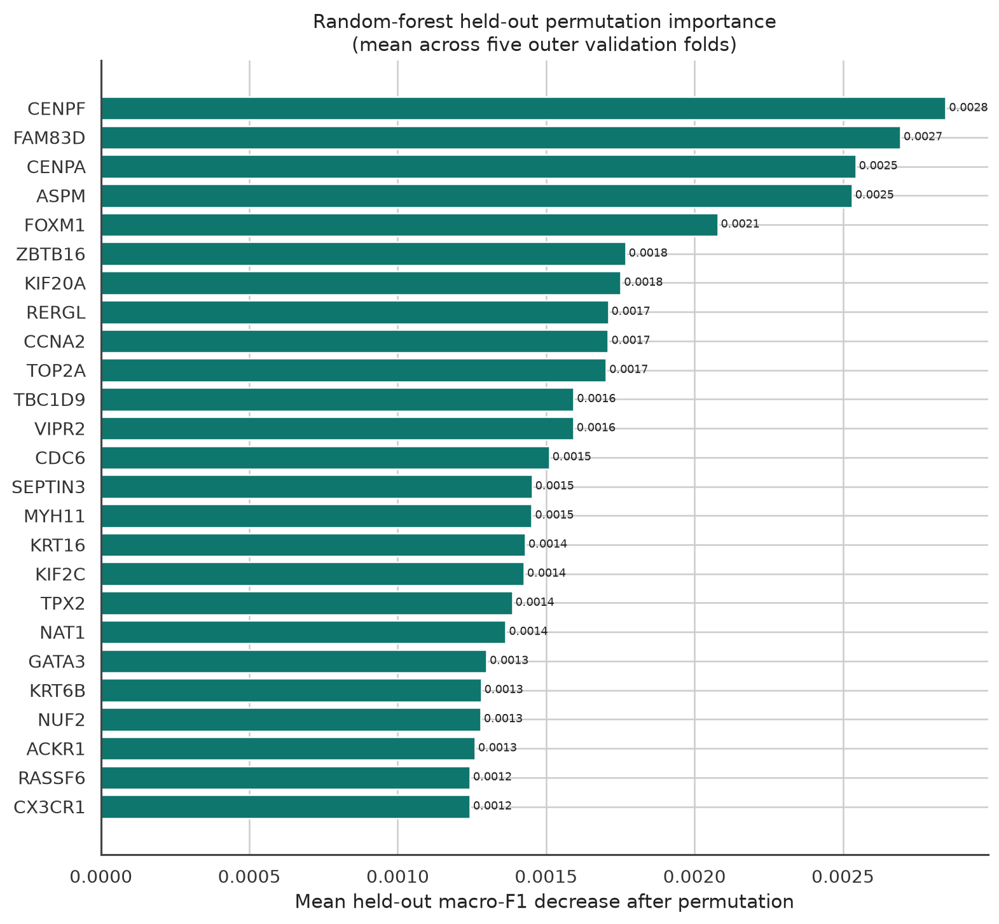
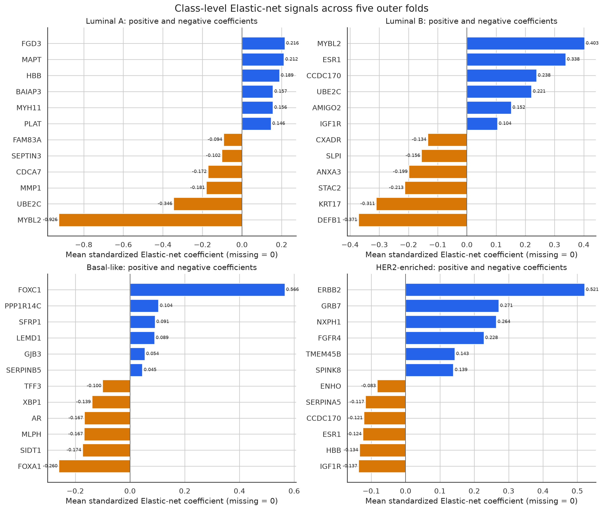
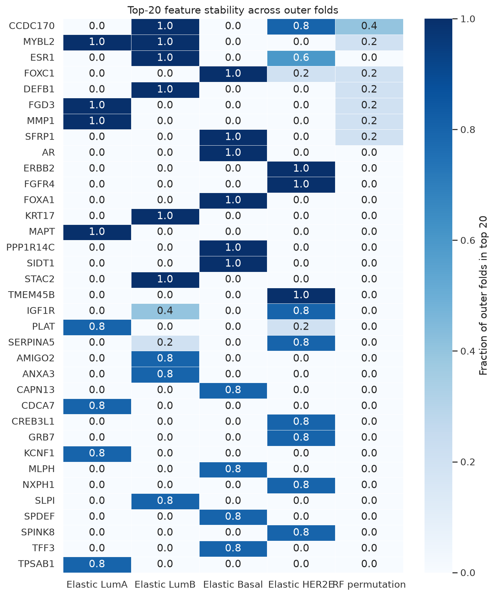
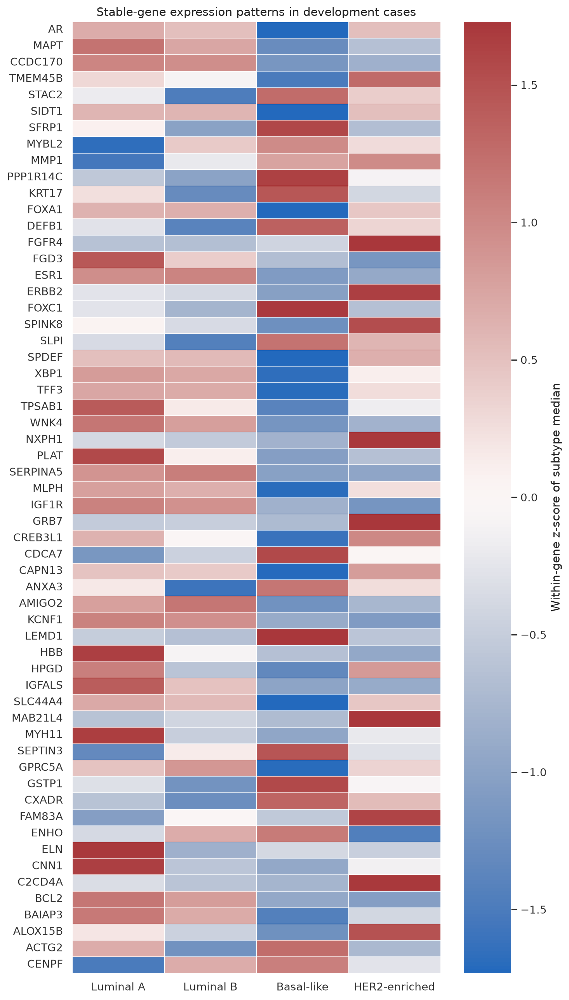
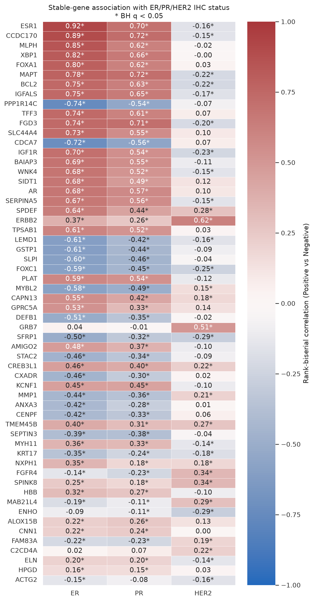
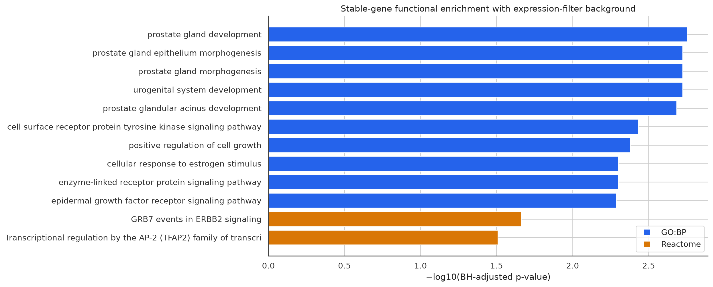
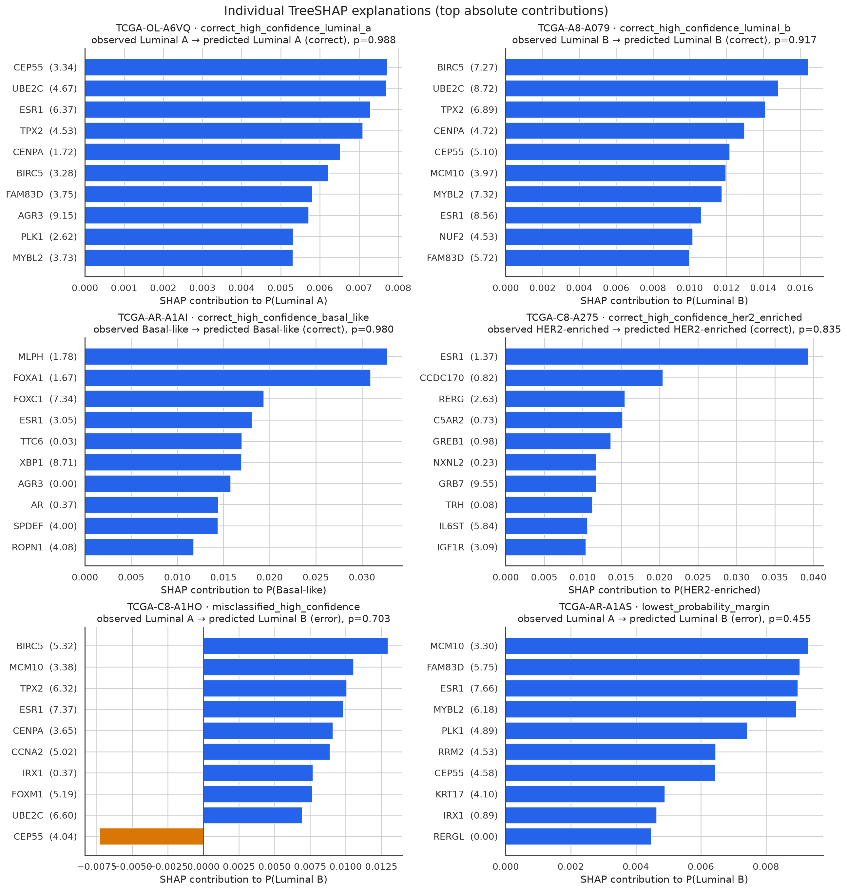

# OncoStratify-BRCA 解释性与生物学验证报告

生成时间：`2026-09-12T16:46:02Z`

## 结论摘要

- 全局与类别级解释基于五个已锁定外层折；Elastic-net系数是标准化输入下的系数，未选择的基因按0计入跨折平均。
- 随机森林permutation importance只在对应outer-validation病例上计算，每折重复5次；没有加载locked-test表达用于该分析。
- 按“任一Elastic-net类别或随机森林permutation进入top 20至少3/5折”的预锁定规则，共得到`58`个稳定重要基因。其中`14`个与锁定PAM50 50基因重叠，`4`个属于预先列出的可检查标志基因。
- 个体解释使用在全部756例development上重拟合的冻结random forest；SHAP background为100例预锁定development病例。只解释6例按预测类别、正确性和置信度预选的locked-test病例，不重新计算性能或选择模型。最大概率重构残差为`4.02e-09`。

## 1. 全局解释：held-out permutation importance

下表给出按五个outer-validation折平均macro-F1下降排序的前10个基因。负值不解释为保护作用，只表示有限验证样本与相关特征下的置换噪声。

| gene_name | macro_f1_importance_mean_including_unselected_zeros | top20_outer_fold_count |
| --- | --- | --- |
| CENPF | 0.002847 | 3 |
| FAM83D | 0.002694 | 1 |
| CENPA | 0.002543 | 2 |
| ASPM | 0.00253 | 2 |
| FOXM1 | 0.002078 | 2 |
| ZBTB16 | 0.001768 | 1 |
| KIF20A | 0.001752 | 1 |
| RERGL | 0.001709 | 1 |
| CCNA2 | 0.001709 | 1 |
| TOP2A | 0.001702 | 1 |

## 2. 类别级解释：Elastic-net positive/negative genes

- **Luminal A**：positive `FGD3, MAPT, HBB, BAIAP3, MYH11`；negative `MYBL2, UBE2C, MMP1, CDCA7, SEPTIN3`。
- **Luminal B**：positive `MYBL2, ESR1, CCDC170, UBE2C, AMIGO2`；negative `DEFB1, KRT17, STAC2, ANXA3, SLPI`。
- **Basal-like**：positive `FOXC1, PPP1R14C, SFRP1, LEMD1, GJB3`；negative `FOXA1, SIDT1, MLPH, AR, XBP1`。
- **HER2-enriched**：positive `ERBB2, GRB7, NXPH1, FGFR4, TMEM45B`；negative `IGF1R, HBB, ESR1, CCDC170, SERPINA5`。

完整结果见`elastic_net_class_top_genes.tsv`与`elastic_net_coefficient_summary.tsv.gz`。

## 3. 跨折稳定性

主要稳定性指标为每个基因在五个外层折中进入top 20的次数/频率；同时保存top 50和top 100指示列。高相关基因会分摊系数或置换重要性，因此排名第一不等于唯一关键基因，也不代表因果作用。

## 4. 稳定基因的表达与PAM50重叠

所有表达分布与检验只使用development病例。每个稳定基因均保存逐病例log2(TPM+1)、四亚型的均值/中位数/IQR，以及Kruskal-Wallis检验和BH q值；每个基因另有一张violin图。

PAM50重叠使用已锁定的50基因表和其中记录的历史符号映射；它是标签内生性审计，不用于提高基因排名。

## 5. ER/PR/HER2临床状态交叉验证

仅纳入有明确Positive/Negative IHC状态的development病例。效应量为“阳性组相对阴性组”的rank-biserial correlation；星号代表同一受体内BH q<0.05。

满足`q<0.05`且`|rank-biserial|≥0.33`的非PAM50临床相关结果：

| receptor | gene_name | positive_n | negative_n | rank_biserial_correlation | bh_q_value |
| --- | --- | --- | --- | --- | --- |
| ER | CCDC170 | 562 | 166 | 0.892 | 0 |
| ER | CDCA7 | 562 | 166 | -0.7237 | 0 |
| ER | FGD3 | 562 | 166 | 0.7391 | 0 |
| ER | IGFALS | 562 | 166 | 0.7479 | 0 |
| ER | PPP1R14C | 562 | 166 | -0.7447 | 0 |
| ER | SLC44A4 | 562 | 166 | 0.7344 | 0 |
| ER | TFF3 | 562 | 166 | 0.7402 | 0 |
| ER | XBP1 | 562 | 166 | 0.8168 | 0 |
| ER | IGF1R | 562 | 166 | 0.7034 | 1.335e-42 |
| ER | BAIAP3 | 562 | 166 | 0.6899 | 4.711e-41 |
| ER | WNK4 | 562 | 166 | 0.6812 | 4.496e-40 |
| ER | SIDT1 | 562 | 166 | 0.6796 | 6.383e-40 |
| ER | AR | 562 | 166 | 0.679 | 7.096e-40 |
| ER | SERPINA5 | 562 | 166 | 0.6699 | 7.209e-39 |
| ER | SPDEF | 562 | 166 | 0.6394 | 1.508e-35 |
| ER | LEMD1 | 562 | 166 | -0.6061 | 2.2e-32 |
| ER | TPSAB1 | 562 | 166 | 0.6078 | 2.782e-32 |
| ER | GSTP1 | 562 | 166 | -0.605 | 5.166e-32 |
| ER | SLPI | 562 | 166 | -0.597 | 3.19e-31 |
| ER | PLAT | 562 | 166 | 0.5897 | 1.561e-30 |

## 6. GO Biological Process与Reactome富集

目标集为上述稳定基因。主背景是五个outer-training低表达过滤器中至少一折通过的全部蛋白编码基因；另用5/5折均通过的基因作为背景敏感性分析。g:Profiler以`domain_scope=custom`执行GO:BP与Reactome过表达检验，并使用BH-FDR阈值0.05。

| source | term_id | term_name | adjusted_p_value | intersection_size |
| --- | --- | --- | --- | --- |
| GO:BP | GO:0030850 | prostate gland development | 0.001768 | 5 |
| GO:BP | GO:0001655 | urogenital system development | 0.001891 | 5 |
| GO:BP | GO:0060512 | prostate gland morphogenesis | 0.001891 | 4 |
| GO:BP | GO:0060740 | prostate gland epithelium morphogenesis | 0.001891 | 4 |
| GO:BP | GO:0060525 | prostate glandular acinus development | 0.002067 | 3 |
| REAC | REAC:R-HSA-1306955 | GRB7 events in ERBB2 signaling | 0.02177 | 2 |
| REAC | REAC:R-HSA-8864260 | Transcriptional regulation by the AP-2 (TFAP2) family of transcription factors | 0.03096 | 3 |

## 7. 已知标志、相关基因与候选基因

分类是可复现的操作性标签，不是穷尽式文献裁定：

- `known_marker_or_PAM50`：预先指定的已知检查基因或锁定PAM50成员；
- `clinically_correlated_non_PAM50`：不属于前一类，但与至少一个IHC受体达到`q<0.05`且效应量绝对值≥0.33；
- `potential_candidate_not_novelty_claim`：其余稳定且亚型表达差异BH q<0.05的基因，需要独立队列和功能实验验证；
- `other_model_associated`：其余稳定模型关联基因。

| evidence_category | gene_count |
| --- | --- |
| clinically_correlated_non_PAM50 | 34 |
| known_marker_or_PAM50 | 14 |
| potential_candidate_not_novelty_claim | 10 |

完整逐基因判定见`biological_validation/stable_gene_evidence_classification.tsv`。“潜在候选”明确不等于新颖性、机制或临床效用结论。

## 8. 个体级TreeSHAP

蓝色条提高预测类别概率，橙色条降低预测类别概率；基因名后的括号是该病例原始log2(TPM+1)。SHAP值是在训练集background条件下对模型输出的归因，不是基因干预效应。

病例选择与概率审计：

| selection_role | case_barcode | observed | predicted | correct | confidence | probability_margin |
| --- | --- | --- | --- | --- | --- | --- |
| correct_high_confidence_luminal_a | TCGA-OL-A6VQ | Luminal A | Luminal A | True | 0.988 | 0.9773 |
| correct_high_confidence_luminal_b | TCGA-A8-A079 | Luminal B | Luminal B | True | 0.9173 | 0.8506 |
| correct_high_confidence_basal_like | TCGA-AR-A1AI | Basal-like | Basal-like | True | 0.98 | 0.968 |
| correct_high_confidence_her2_enriched | TCGA-C8-A275 | HER2-enriched | HER2-enriched | True | 0.8347 | 0.7573 |
| misclassified_high_confidence | TCGA-C8-A1HO | Luminal A | Luminal B | False | 0.7026 | 0.4333 |
| lowest_probability_margin | TCGA-AR-A1AS | Luminal A | Luminal B | False | 0.4546 | 0.001282 |

完整四类别、全部2,000个模型输入的SHAP值见`shap_values_selected_cases.tsv.gz`。

## 9. 方法学边界

- PAM50标签由表达信号生成，因此本项目主要验证模型复现既有分型的能力，不是独立发现亚型。
- 高维相关性会在Elastic-net系数、permutation importance与SHAP贡献之间分摊信号；单基因排名不可视为唯一机制。
- TCGA是单一回顾性队列；临床受体交叉验证是内部一致性检查，不能替代外部验证或前瞻性临床评价。
- 预期信号（ESR1、PGR、ERBB2、FOXA1、GATA3、MKI67、KRT5、KRT14、KRT17、EGFR）只被审计，没有强制进入特征集、稳定列表或图表。

## 10. 主要方法来源

- Parker et al., 2009, PAM50 classifier: https://doi.org/10.1200/JCO.2008.18.1370
- TCGA Network, 2012, molecular portraits of human breast tumours: https://doi.org/10.1038/nature11412
- Lundberg et al., 2020, TreeSHAP: https://doi.org/10.1038/s42256-019-0138-9
- Kolberg et al., 2023, g:Profiler and custom-background enrichment: https://doi.org/10.1093/nar/gkad347
