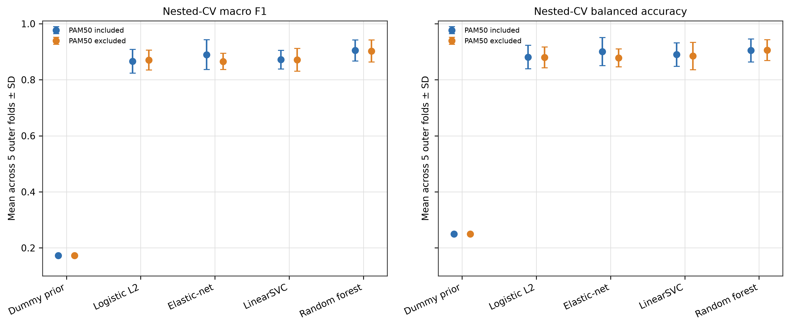
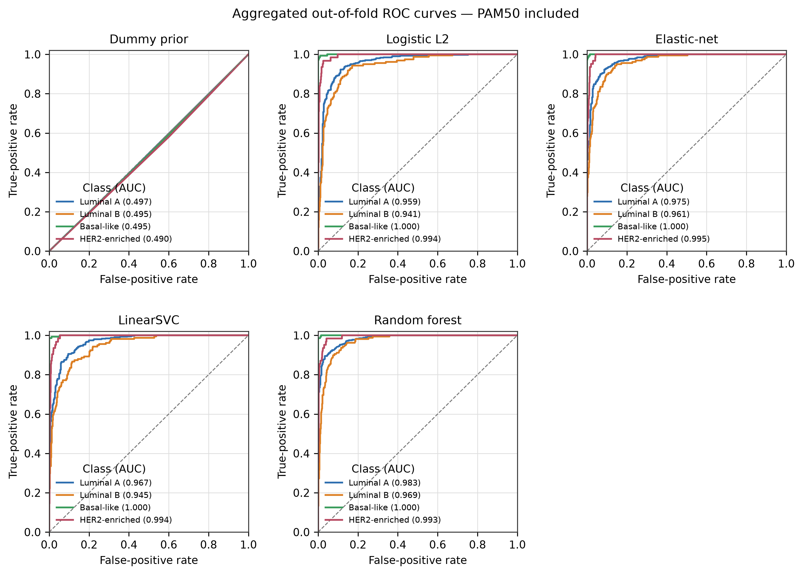
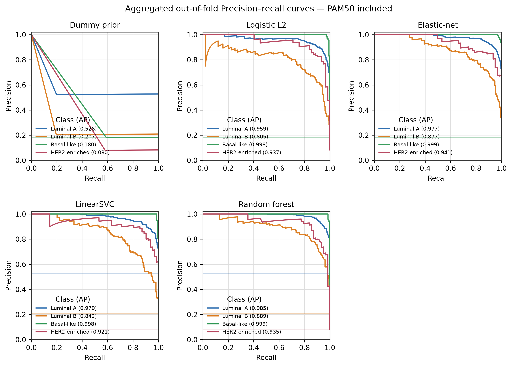
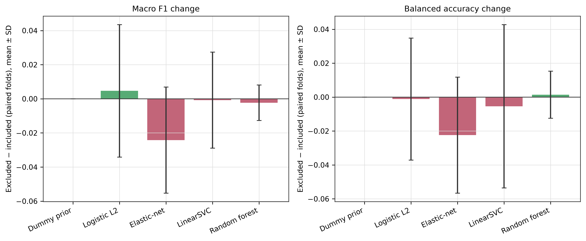
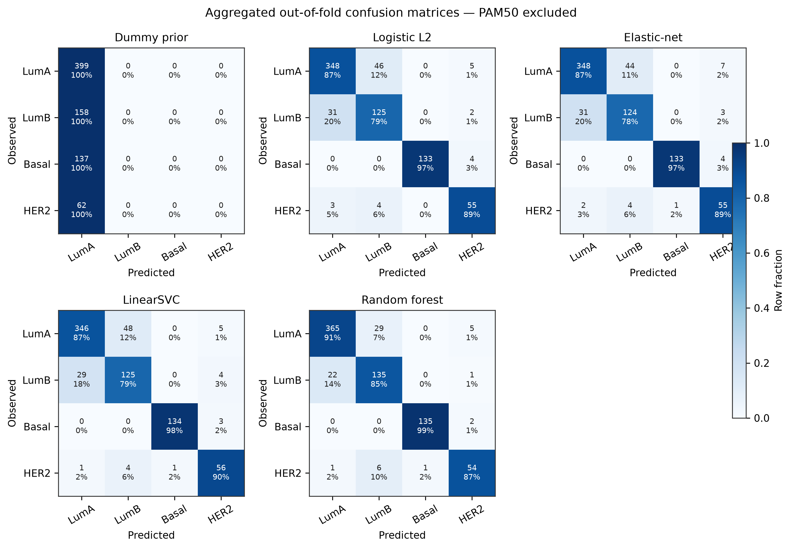
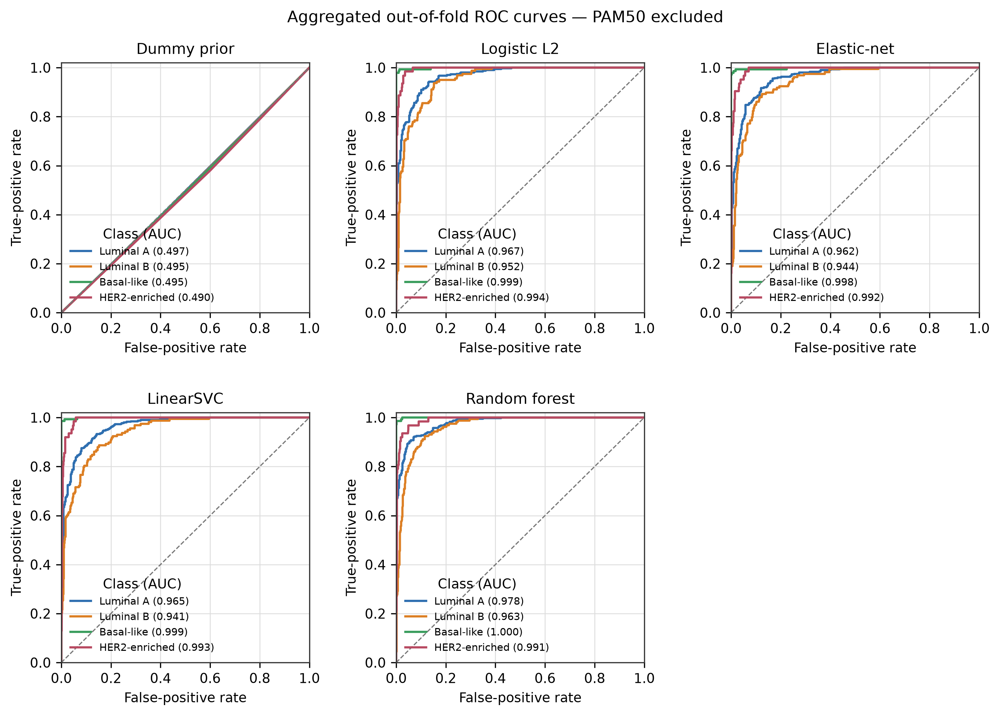
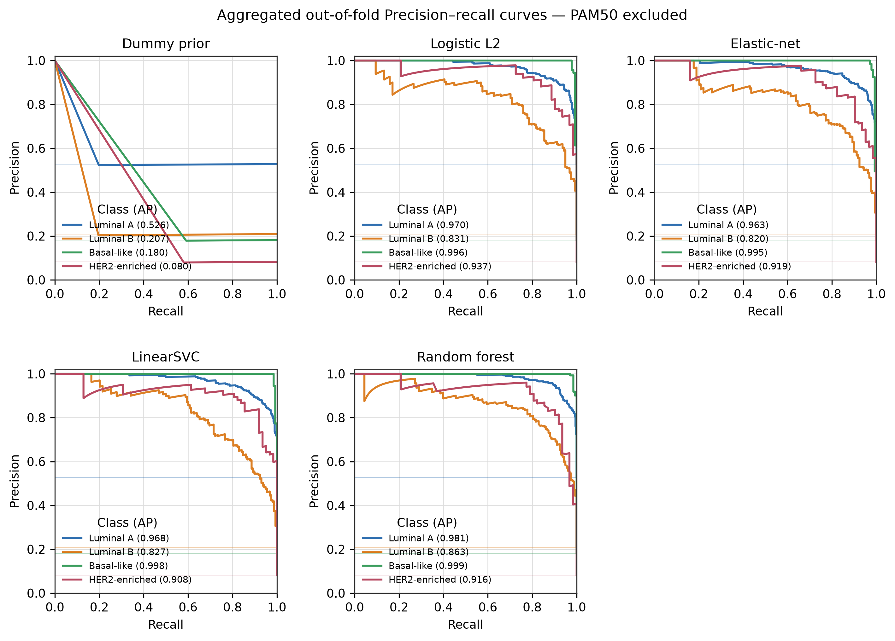
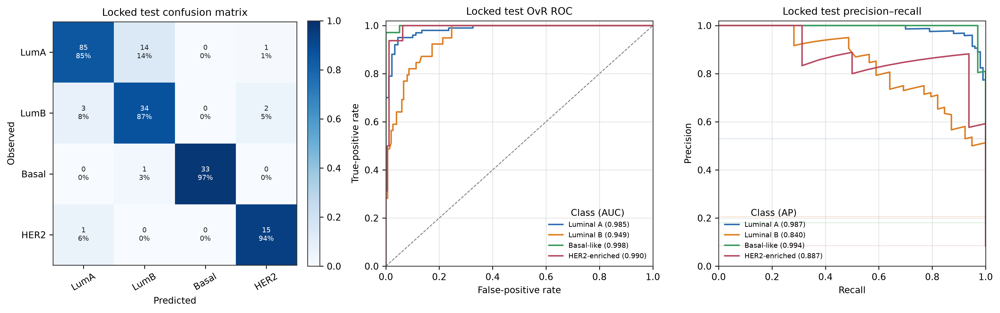

# OncoStratify-BRCA 统一性能报告

**生成时间：** 2026-09-11 12:22 UTC  
**主分析：** 四分类 PAM50，756例 development，189例 locked test  
**预先指定的模型选择指标：** outer nested-CV mean macro F1；balanced accuracy 为共同主要报告指标。

## 1. 结论

在 PAM50-included 主分析中，按预注册规则选择 **Random forest**。其 outer-fold mean macro F1 比第二名高 **0.015**，超过0.01平局阈值，因此未启用简约性平局规则。所有候选模型的比较仅使用 development OOF 结果；最终模型冻结后，locked test 只评估一次。

locked test 的两个主要指标及病例级分层 bootstrap 95% percentile CI：

| 指标 | 估计 | 95% CI下限 | 95% CI上限 |
| --- | --- | --- | --- |
| balanced_accuracy | 0.907 | 0.855 | 0.945 |
| macro_f1 | 0.885 | 0.836 | 0.929 |

## 2. PAM50-included nested-CV

下表均为5个 outer folds 的均值和样本标准差。分类标签来自原始分类器；LinearSVC 的 ROC/PR 概率来自每个 outer-training partition 内完成的 sigmoid 校准。

| 模型 | macro F1 均值 | macro F1 SD | balanced accuracy 均值 | balanced accuracy SD | macro OvR AUC | macro PR-AUC/AP |
| --- | --- | --- | --- | --- | --- | --- |
| Dummy prior | 0.173 | 0.001 | 0.250 | 0.000 | 0.500 | 0.250 |
| Logistic L2 | 0.866 | 0.043 | 0.881 | 0.042 | 0.981 | 0.944 |
| Elastic-net | 0.890 | 0.053 | 0.901 | 0.050 | 0.985 | 0.955 |
| LinearSVC | 0.872 | 0.034 | 0.890 | 0.042 | 0.977 | 0.934 |
| Random forest | 0.905 | 0.038 | 0.905 | 0.041 | 0.986 | 0.954 |

## 3. 聚合 OOF 逐类性能

完整逐类 precision、recall、F1、support 见 `oof_per_class_metrics.tsv`；逐类 OvR ROC-AUC 与 PR-AUC/AP 分别见 `oof_roc_auc.tsv` 和 `oof_pr_auc.tsv`。

| 模型 | 类别 | n | precision | recall | F1 | OvR ROC-AUC | PR-AUC/AP | 类别比例 |
| --- | --- | --- | --- | --- | --- | --- | --- | --- |
| Dummy prior | Luminal A | 399 | 0.528 | 1.000 | 0.691 | 0.497 | 0.526 | 0.528 |
| Dummy prior | Luminal B | 158 | 0.000 | 0.000 | 0.000 | 0.495 | 0.207 | 0.209 |
| Dummy prior | Basal-like | 137 | 0.000 | 0.000 | 0.000 | 0.495 | 0.180 | 0.181 |
| Dummy prior | HER2-enriched | 62 | 0.000 | 0.000 | 0.000 | 0.490 | 0.080 | 0.082 |
| Logistic L2 | Luminal A | 399 | 0.918 | 0.872 | 0.895 | 0.959 | 0.959 | 0.528 |
| Logistic L2 | Luminal B | 158 | 0.715 | 0.778 | 0.745 | 0.941 | 0.805 | 0.209 |
| Logistic L2 | Basal-like | 137 | 0.985 | 0.971 | 0.978 | 1.000 | 0.998 | 0.181 |
| Logistic L2 | HER2-enriched | 62 | 0.800 | 0.903 | 0.848 | 0.994 | 0.937 | 0.082 |
| Elastic-net | Luminal A | 399 | 0.939 | 0.892 | 0.915 | 0.975 | 0.977 | 0.528 |
| Elastic-net | Luminal B | 158 | 0.766 | 0.848 | 0.805 | 0.961 | 0.877 | 0.209 |
| Elastic-net | Basal-like | 137 | 0.985 | 0.978 | 0.982 | 1.000 | 0.999 | 0.181 |
| Elastic-net | HER2-enriched | 62 | 0.833 | 0.887 | 0.859 | 0.995 | 0.941 | 0.082 |
| LinearSVC | Luminal A | 399 | 0.928 | 0.870 | 0.898 | 0.967 | 0.970 | 0.528 |
| LinearSVC | Luminal B | 158 | 0.723 | 0.810 | 0.764 | 0.945 | 0.842 | 0.209 |
| LinearSVC | Basal-like | 137 | 0.993 | 0.978 | 0.985 | 1.000 | 0.998 | 0.181 |
| LinearSVC | HER2-enriched | 62 | 0.800 | 0.903 | 0.848 | 0.994 | 0.921 | 0.082 |
| Random forest | Luminal A | 399 | 0.951 | 0.922 | 0.936 | 0.983 | 0.985 | 0.528 |
| Random forest | Luminal B | 158 | 0.784 | 0.873 | 0.826 | 0.969 | 0.889 | 0.209 |
| Random forest | Basal-like | 137 | 0.993 | 0.985 | 0.989 | 1.000 | 0.999 | 0.181 |
| Random forest | HER2-enriched | 62 | 0.912 | 0.839 | 0.874 | 0.993 | 0.935 | 0.082 |

## 4. PAM50-included 与 excluded

excluded 方案在进入 Pipeline 前移除锁定的50个 PAM50 signature 基因，并保持同一病例、同一 outer/inner folds、同一模型网格。差值定义为 excluded − included；该敏感性分析不覆盖主模型排名。

| 模型 | 指标 | excluded − included 均值 | 配对差 SD | excluded 更高折数/5 |
| --- | --- | --- | --- | --- |
| Dummy prior | macro_f1 | 0.000 | 0.000 | 0 |
| Dummy prior | balanced_accuracy | 0.000 | 0.000 | 0 |
| Logistic L2 | macro_f1 | 0.005 | 0.039 | 2 |
| Logistic L2 | balanced_accuracy | -0.001 | 0.036 | 2 |
| Elastic-net | macro_f1 | -0.024 | 0.031 | 1 |
| Elastic-net | balanced_accuracy | -0.022 | 0.034 | 1 |
| LinearSVC | macro_f1 | -0.001 | 0.028 | 2 |
| LinearSVC | balanced_accuracy | -0.005 | 0.048 | 1 |
| Random forest | macro_f1 | -0.002 | 0.010 | 2 |
| Random forest | balanced_accuracy | 0.001 | 0.014 | 3 |

excluded 的完整混淆矩阵与逐类曲线：

## 5. 最终 locked test

| 指标 | locked test 估计 |
| --- | --- |
| balanced_accuracy | 0.907 |
| macro_f1 | 0.885 |
| accuracy | 0.884 |
| macro_ovr_roc_auc | 0.981 |
| macro_average_precision | 0.927 |
| multiclass_log_loss | 0.384 |

较小类别（按test support排序）的召回率、F1和 average precision：

| 类别 | n | recall | F1 | PR-AUC/AP |
| --- | --- | --- | --- | --- |
| HER2-enriched | 16 | 0.938 | 0.882 | 0.887 |
| Basal-like | 34 | 0.971 | 0.985 | 0.994 |

全部 locked-test 逐类结果：

| 类别 | precision | recall | F1 | n | OvR ROC-AUC | PR-AUC/AP | 类别比例 |
| --- | --- | --- | --- | --- | --- | --- | --- |
| Luminal A | 0.955 | 0.850 | 0.899 | 100 | 0.985 | 0.987 | 0.529 |
| Luminal B | 0.694 | 0.872 | 0.773 | 39 | 0.949 | 0.840 | 0.206 |
| Basal-like | 1.000 | 0.971 | 0.985 | 34 | 0.998 | 0.994 | 0.180 |
| HER2-enriched | 0.833 | 0.938 | 0.882 | 16 | 0.990 | 0.887 | 0.085 |

完整逐类指标见 `../final_evaluation/locked_test_per_class_metrics.tsv`；所有总体及逐类 bootstrap CI 见 `../final_evaluation/bootstrap_confidence_intervals.tsv`。

## 6. 解释边界

- Nested-CV 的“±”是5个 outer folds 的标准差，不是95%置信区间。
- 95% bootstrap CI 仅针对一次性 locked-test 评估，默认1,000次、以病例为单位并按真实 PAM50 类别分层。
- PR-AUC 在表中以 average precision 实现；它对 HER2-enriched 等较小类别比 accuracy 更有信息。
- 不为每个候选模型分别查看 locked test：这样会把测试集转化为额外的模型选择集，违反预先锁定的一次性评估政策。
- PAM50 标签由表达模式定义，因此高性能表示对既有 PAM50 分型的复现，不等同于独立临床获益预测。

## 7. 可复现性

原始逐病例 OOF 概率、逐折指标、curve points、混淆矩阵、PAM50排除差异和最终测试结果均保存为 TSV；`run_manifest.json`记录输入与输出哈希。PAM50 signature 来源固定到 `genefu` commit `9c9b66d1ef22cbfda1df75b626d2dbc68fb9b25c`。
